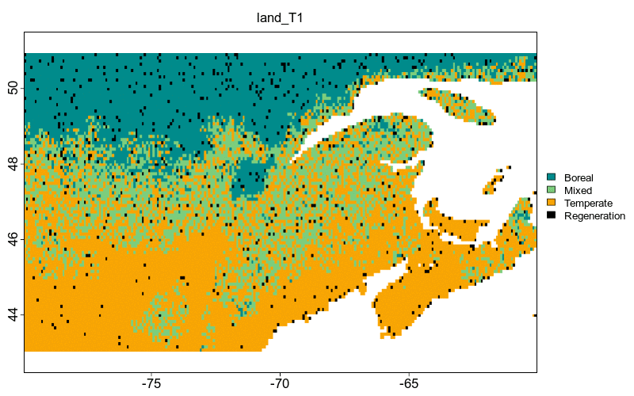

```{r knitr_opts, echo = FALSE}
knitr::opts_chunk$set(
  collapse = TRUE,
  comment = "#>",
  fig.align = "center"
)
```

Instead of using a virtual landscape, the `{STManaged}` package provides a landscape with real values of temperature and precipitation for the eastern North American forest.

```{r, message = FALSE}
library(STManaged)
```

## Initiate the landscape

As the landscape is already defined, to initiate the real landscape you have to just call the `create_real_landscape()` function:

```{r}
initLand <- create_real_landscape()
```

```{r, echo=FALSE}
tr = round(range(raster::values(initLand[['land']][['tp']]), na.rm = T), 2)
pr = round(range(raster::values(initLand[['land']][['pp']]), na.rm = T), 2)
```

The defined landscape has temperature ranging from `r tr[1]` to `r tr[2]` $^\circ$C, and precipitation from `r pr[1]` to `r pr[2]` mm.

`initLand` is a list of `r length(initLand)` objects with information about the landscape. `land` is a raster with 3 layers informing (i) the forest state, (ii) temperature and (iii) precipitation for each cell. The other two objects have information about cells neighbor to be used internally.

Let's take a look in the `initLand` using the function `plot_landscape()`:

```{r,fig.width=10,fig.height=7}
plot_landscape(initLand, Title = 'initial_landscape')
```

Note that when using the real landscape the arguments `xaxis`, `rmBorder` and `rangeLimitOccup` are not considered.


## Run the model

With the initial landscape set, we can now run the model using the function `run_model()`.
We will run the model for 100 years (1 step = 5 years). For now the models supports only the RCP 8.5 scenario when using a real landscape:

```{r,eval=F}
lands <- run_model(steps = 20,
                   initLand = initLand)
```

```{r,echo=F}
load('data/landsReal.Rdata')
```

The model output `lands` is a list containing a raster with all `land` steps and the initial climate condition (temperature and precipitation), and other useful information such as (i) steps, (ii) management intensity, (iII) RCP scenario and (v) landscape dimensions.


## Plot output

For the real landscape you cannot use the functions `plot_occupancy()` and `plot_rangeShift()`, only `animate()`.

## Animation

```{r,eval=F}
animate(lands, fps = 5, gifName = 'RCP8.5')
```


