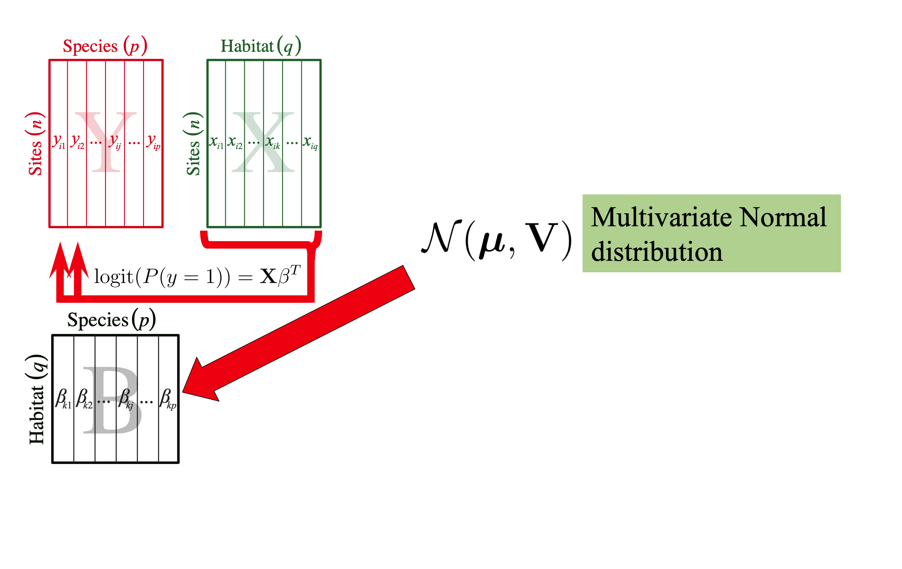
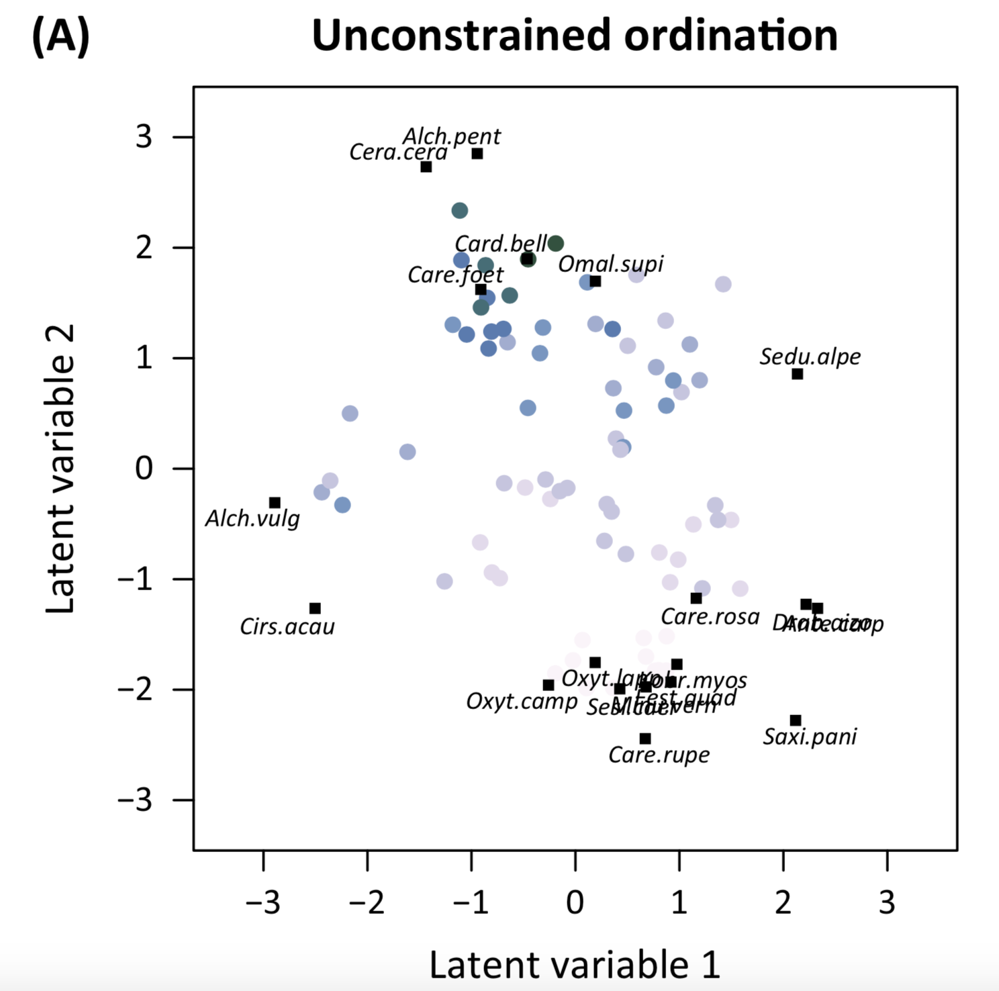

# Joint species distribution models (JSDM)

JSDM are a fairly new groups of models that are emerging in the litterature

In essence they are:
- Multivariate (multi-species)
- Relying on a strong statistical basis
- Flexible. That is, they allow for multiple type of data and new questions to be approach

At the moment, they seemed to be more a statistican toy than an ecologist tool.


---

# Joint species distribution models (JSDM)

There are many variant of JSDM

- Hierarchical modelling of species community (HMSC)
- Bayesian ordination and regression analysis (boral)
- Generalized Joint Attribute Modeling (gjam)
- Bayesian Community Ecology Analysis
- etc.

## Note

Although many of these variant are Bayesian, this is not a necessity for JSDM

Today we will focus on HMSC... It is Bayesian

---

# Frequentist and Bayesian modelling
## Frequentist

Want to find the best model parameter(s) for the data at hand

$$\text{Likelihood}\hspace{1.5cm}P(\text{Data}|\text{Model})$$

### They need data

They are interested in maximizing the Likelihood

This can be done using
- Simulated annealing
- The Nelder-Mead Simplex
- Minimizing the sums of squares
- etc.

---

# Frequentist and Bayesian modelling
## Bayesian

Want to find how good the model parameter(s) are given some data

$$\text{Posterior}\hspace{1.5cm}P(\text{Model}|\text{Data})$$
### They need data and prior information

They are intered in the posterior distribution

How they do this:

$$\underbrace{P(\text{Model}|\text{Data})}_\text{Posterior}\propto \underbrace{P(\text{Data}|\text{Model})}_\text{Likelihood}\underbrace{P(\text{Model})}_\text{Prior}$$

---

# Hierarchical modelling of species community (HMSC)

Since the 2011 paper by Ovaskainen and Soininen, there has been a number of developments within HMSC, most of which are available in the `HMSC` R package.

Today, we will focus only on a few of these developments

Let's start with the idea propose by Ovaskainen and Soininen (2011) where we have

$\mathbf{Y}$ - A matrix of sites (rows) by species (columns) that states whether is each species occurs (1) or not (0) across the sites

$\mathbf{X}$ - A matrix of sites (rows) by environment or habitat characteristics (columns)

---

# Hierarchical modelling of species community (HMSC)

<div style='text-align:center;'>
</img>
</div>

---

# Hierarchical modelling of species community (HMSC)

<div style='text-align:center;'>
</img>
</div>

---

# Hierarchical modelling of species community (HMSC)

<div style='text-align:center;'>
</img>
</div>

---

# Hierarchical modelling of species community (HMSC)

<div style='text-align:center;'>
</img>
</div>

---

# Hierarchical modelling of species community (HMSC)

What this model does is to use the information from all the species available to better estimate each species.

## How good is this approach?

They performed a simulation where:
- The probability of occurrence of a common species increases with the value of an explanatory variable increases
- The probability of occurrence of a rare species increases importantly with the value of an explanatory variable increases

---

# Hierarchical modelling of species community (HMSC)
## How good is this approach?

<div style='text-align:center;'>
</img>
</div>

---

# Hierarchical modelling of species community (HMSC)
## A few particularity about this approach

- To get unbiased parameter estimation we should account for <font size = 6 color = "blue">all</font> the species that <font size = 6 color = "blue">should</font> be present in the studied community.
- No information on species interaction is considered
- It can be applied to data where there are many species and relatively few samples
- It assumes each species reacts to the environment on average the same way... with a diffence variance/covariance

---

# Hierarchical modelling of species community (HMSC)
## How are the parameters estimated in practice?

Although Bayesian models can be estimated analytically (... that is by solving the math!), it can become challenging to this with more complex models.

A solution is to use Markov chain Monte Carlo (MCMC).

---

# Markov chain Monte Carlo (MCMC)

Markov chain Monte Carlo methods are a group of sampling procedure that can be used to estimate model parameters.

## Example of MCMC methods
- Rejection sampling
- Metropolis-Hastings algorithm
- Gibbs sampling
- etc.

---

# Markov chain Monte Carlo (MCMC)

## Advantages of MCMC
- It allows to approach very (!) complex model structure
- Confidence intervals are obtained for free !

## Disadvantages of MCMC
- It is time consumming to estimate a model
- It requires a lot of computer

---

# Markov chain Monte Carlo (MCMC)

## Assumption of MCMC
- All potential parameter combinations can be reached from all other parameter combination
- After enough iterations the chain will converges to a stationary distribution

---

# Markov chain Monte Carlo (MCMC)

## Assumption of MCMC
- All potential parameter combinations can be reached from all other parameter combination
- After enough iterations the chain will converges to a stationary distribution

What does enough iterations mean? What is a stationary distribution? What does "converge" mean?

<div style='text-align:center;'>
</img>
</div>

---

# Markov chain Monte Carlo (MCMC)
## How many iterations is enough...
### A rough procedure

1. Perform a pilot run for a reduced number of steps (10 to 100) and measure the time it takes
2. Decide on a number of steps to run the algorithm to obtain a result in a reasonable amount of time
3. Run the algorithm again !
4. Study the chain visually

### A more statistical way - The Raftery-Lewis diagnostic

It relies on a pilot run to estimate the number of steps to be carried out.

It is implemented in the `raftery.diag` function of the `coda` R package

---

# Markov chain Monte Carlo (MCMC)
## Good practice

<div style='text-align:center;'>
</img>
</div>

```{r, dev='tikz',fig.align="center",fig.width = 12,fig.height = 6,echo=FALSE, eval = FALSE}
par(mfrow=c(3,1),mar=c(2,2,3,0.5),oma=c(5,5,0,0))

perfect <- rnorm(5000,mean=3)
plot(perfect,type="l", ylab="",xlab="",las=1,cex.axis=2, col= "red")
title("Perfect",cex.main=3)

auto <- as.vector(arima.sim(n=5000,list(ar=c(0.95)),mean=0.1))
plot(auto,type="l", ylab="",xlab="",las=1,cex.axis=2, col= "blue")
title("Needs to be ran longer with thinning",cex.main=3)

burn <- 3/(1+(1:5000)^(-0.5))+rnorm(5000,sd=0.15)
plot(burn,type="l", ylab="",xlab="",las=1,cex.axis=2, col= "darkgreen")
title("Needs burn-in or a better starting value",cex.main=3)

mtext("Steps",side=1,cex=3,outer=TRUE,line=1.75)
mtext("$\\theta$",side=2,cex=3,outer=TRUE,line=1.25)
```


---

# Markov chain Monte Carlo (MCMC)
## Thinning

Thinning is essentially subsampling
<div style='text-align:center;'>
</img>
</div>

```{r,dev='tikz',fig.align="center",fig.width = 12,fig.height = 2,echo=FALSE,eval=FALSE}
par(mar=c(5,5,3,0.5))

plot(auto, type = "l", xlab = "Steps",  ylab = "$\\theta$",
     las=1, cex.axis = 1.2, cex.lab = 3, col= "blue")
```


If we ran the same MCMC as above but instead for 50000 steps and we save $\theta$ at every 10 steps, we obtain

<div style='text-align:center;'>
</img>
</div>

```{r,dev='tikz',fig.align="center", fig.width = 12,fig.height = 2,echo=FALSE,eval=FALSE}
par(mar=c(5,5,3,0.5))

autoLong <- as.vector(arima.sim(n=50000,list(ar=c(0.95)),mean=0.1))
plot(autoLong[seq(10,50000,by=10)], type = "l", xlab = "Steps",
     ylab = "$\\theta$", las = 1, cex.axis = 1.2, cex.lab = 3,
     col = "blue")
```

---

# Markov chain Monte Carlo (MCMC)
## Burn-in

Burn-in is throwing away some iterations at the beginning of the MCMC run

<div style='text-align:center;'>
</img>
</div>

```{r,dev='tikz',fig.width = 8,fig.height = 2.5,echo=FALSE,eval=FALSE}
par(mar=c(5,5,3,0.5))

plot(burn, type = "l", xlab = "Steps",  ylab = "$\\theta$",
     las=1, cex.axis = 1.2, cex.lab = 3, col= "darkgreen")

abline(v=500,col="red",lwd=3)
```

After burn-in, we obtain

<div style='text-align:center;'>
</img>
</div>

```{r,dev='tikz',fig.width = 8,fig.height = 2.5,echo=FALSE,eval=FALSE}
par(mar=c(5,5,3,0.5))

burnin<-burn
burnin[1:500]<-NA

plot(burnin, type = "l", xlab = "Steps",
     ylab = "$\\theta$", las=1, cex.axis = 1.2, cex.lab = 3,
     col= "darkgreen")
```

---

# Markov chain Monte Carlo (MCMC)
## Convergence

A way to check for convergence is to rerun the same MCMC multiple times but using different starting values (i.e. different chains)

<div style='text-align:center;'>
</img>
</div>

```{r,dev='tikz',fig.width = 8,fig.height = 2.5,echo=FALSE,eval=FALSE}
auto2 <- as.vector(arima.sim(n=5000,list(ar=c(0.92)),mean=0.5))

par(mar=c(5,5,3,0.5))
plot(auto, type = "l", xlab = "Steps",  ylab = "$\\theta$",
     las=1, cex.axis = 1.2, cex.lab = 3, col = "blue",
     ylim = range(auto,auto2))
lines(auto2,col="orange",lty=2)
```


---

# Markov chain Monte Carlo (MCMC)
## Convergence
### Geweke convergence diagnostic

It compares two sections of the same chain

It is, in essence, a two sample $t$ test of mean with unequal variance

It is implemented in the `geweke.diag` function of the `coda` R package

---

# Markov chain Monte Carlo (MCMC)
## Convergence
### Gelman-Rubin convergence diagnostic
It compares multiple chains

it is a corrected ratio of the pooled variance of all chains with the within variance of each chain...


<div style='text-align:center;'>
</img>
</div>

---

# Markov chain Monte Carlo (MCMC)
## Convergence
### Gelman-Rubin convergence diagnostic
It compares multiple chains

it is a corrected ratio of the pooled variance of all chains with the within variance of each chain...


<div style='text-align:center;'>
</img>
</div>


Essentially it is a special type of ANOVA

It is implemented in the `gelman.diag` function of the `coda` R package

---

# Hierarchical modelling of species community (HMSC)

$$\text{logit}(P(\mathbf{Y} = 1)) = \mathbf{X}\mathbf{B}^T$$
where
$$\mathbf{B} \sim {\cal N}(\boldsymbol{\mu},\mathbf{V})$$

Can we do better?

<div style='text-align:center;'>
</img>
</div>

---

# Hierarchical modelling of species community (HMSC)

<div style='text-align:center;'>
</img>
</div>

---

# Hierarchical modelling of species community (HMSC)

$$\text{logit}(P(\mathbf{Y} = 1)) = \mathbf{X}\mathbf{B}^T + \boldsymbol{\alpha}$$
where
$$\mathbf{B} \sim {\cal N}(\boldsymbol{\mu},\mathbf{V})$$
$$\boldsymbol{\alpha} \sim {\cal N}(0,\mathbf{\Sigma})$$

$\boldsymbol{\alpha}$ - Random effect on the species

$\mathbf{\Sigma}$ - Species by species covariance matrix

---

# Hierarchical modelling of species community (HMSC)

$$\text{logit}(P(\mathbf{Y} = 1)) = \mathbf{X}\mathbf{B}^T + \boldsymbol{\alpha}$$
where
$$\mathbf{B} \sim {\cal N}(\boldsymbol{\mu},\mathbf{V})$$
$$\boldsymbol{\alpha} \sim {\cal N}(0,\mathbf{\Sigma})$$

$\boldsymbol{\alpha}$ - Random effect on the species

$\mathbf{\Sigma}$ - Species by species covariance matrix

In less technical words, we can include a random effect on the species to account for the variance in the species data unexplained by the environmental variables.

---

# Hierarchical modelling of species community (HMSC)
## With a species-level random effect

The problem with this type of model is that it is very (!) hard to estimate $\mathbf{\Sigma}$


---

# Hierarchical modelling of species community (HMSC)
## With a species-level random effect

The problem with this type of model is that it is very (!) hard to estimate $\mathbf{\Sigma}$

However, there is a mathematical trick

We can decompose $\mathbf{\Sigma}$ as

$$\mathbf{\Sigma} = \mathbf{\Sigma}_\text{signal} + \mathbf{\Sigma}_\text{noise}$$
and further with matrix decomposition

$$\mathbf{\Sigma} = \mathbf{\Lambda}\mathbf{\Lambda}^T + \mathbf{\Sigma}_\text{noise}$$

---

# Hierarchical modelling of species community (HMSC)
## With a species-level random effect

Using the trick in the previous slide, we can rewrite

$$\text{logit}(P(\mathbf{Y} = 1)) = \mathbf{X}\mathbf{B}^T + \boldsymbol{\alpha}$$

to

$$\text{logit}(P(\mathbf{Y} = 1)) = \mathbf{X}\mathbf{B}^T + \mathbf{H}\mathbf{\Lambda}^T$$

$\mathbf{H}$ - Latent variables

$\mathbf{\Lambda}$ - Parameters associated to the latent variables

---

# Hierarchical modelling of species community (HMSC)
## With a species-level random effect
### How are these weird parameters calculated?

<div style='text-align:center;'>
</img>
</div>

---

# Hierarchical modelling of species community (HMSC)
## With a species-level random effect
### How are these weird parameters calculated?

<div style='text-align:center;'>
</img>
</div>

Let's wave this off as voodoo statistical magic for now... and let's just say that it is done with a rather complicated Gibbs sampler.

---

# Hierarchical modelling of species community (HMSC)
## With a species-level random effect
### What do these weird parameters mean?

- Important explanatory variables not accounted for in the model
- Important explanatory variables that are impossible to sample

---

# Hierarchical modelling of species community (HMSC)
## With a species-level random effect
### What do these weird parameters mean? - Example
$$\text{logit}(P(\mathbf{Y} = 1)) = \mathbf{H}\mathbf{\Lambda}^T$$
<div style='text-align:center;'>
</img>
</div>


---

# Hierarchical modelling of species community (HMSC)
## With a species-level random effect
### What do these weird parameters mean? - Example
$$\text{logit}(P(\mathbf{Y} = 1)) = \mathbf{X}\mathbf{B}^T + \mathbf{H}\mathbf{\Lambda}^T$$

<div style='text-align:center;'>
</img>
</div>

---

# Hierarchical modelling of species community (HMSC)
## With a species-level random effect
### Another (confusing) way to present the result
$$\mathbf{\Sigma}_\text{signal}  = \mathbf{\Lambda}\mathbf{\Lambda}^T$$
<div style='text-align:center;'>
</img>
</div>


---

# Hierarchical modelling of species community (HMSC)
## With a species-level random effect
### Another (confusing) way to present the result

Why is this confusing?

Because it leads us to believe that Latent variables model
- Biotic interactions
- Species associations

This is <font size = 6 color = "red">Wrong!</font>

Based on the way these results are presented, it may be tempting to make this intellectual jump, but we should not do it.
